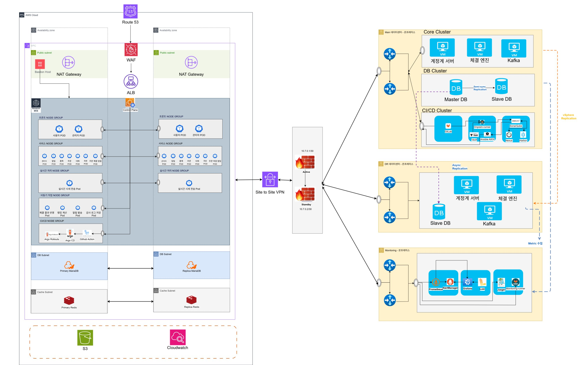
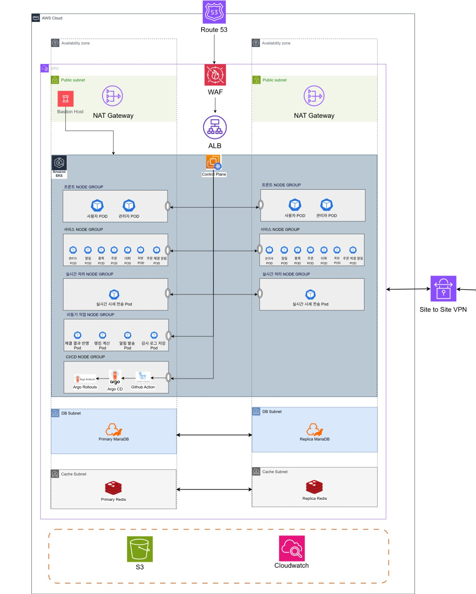
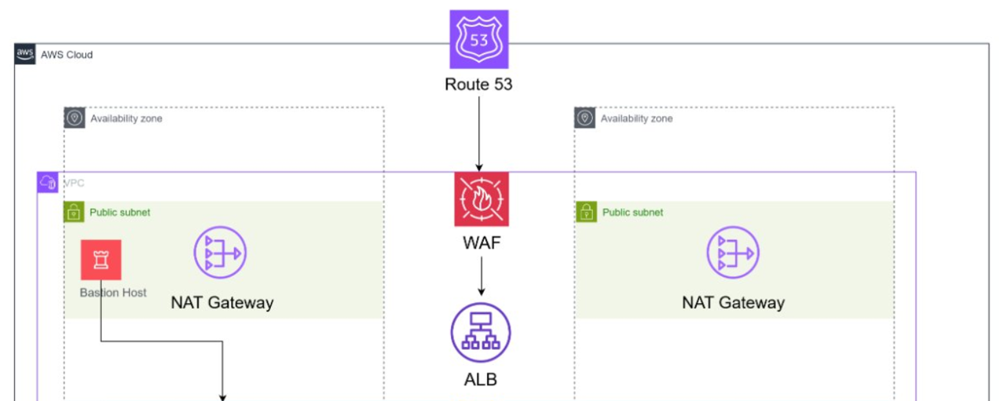
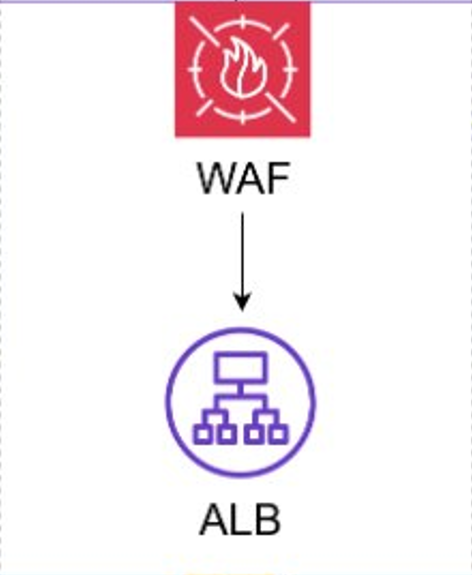
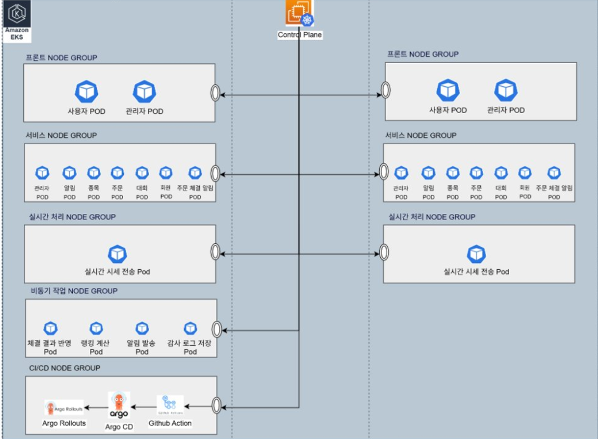
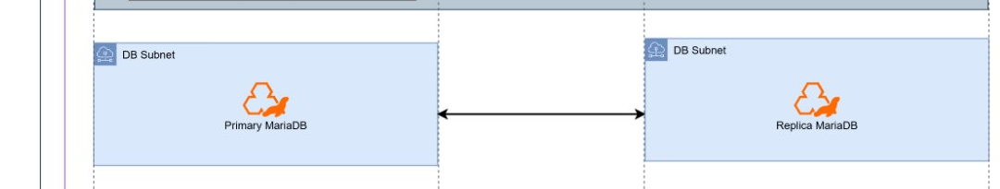
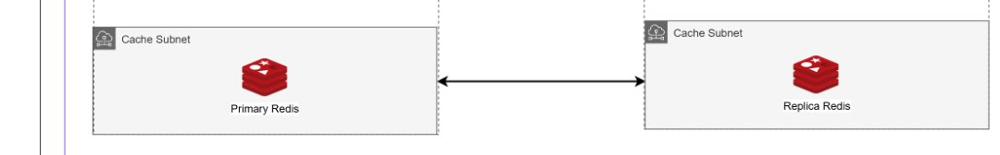

# AWS 인프라 구성 설명서

> **프로젝트**: 한국투자증권 OpenAPI 기반 모의투자 서비스 — 채널계 인프라
> **리전**: `ap-northeast-2` (서울)
> **Terraform**: `>= 1.5.0` / **AWS Provider**: `~> 5.0`

<br>

---

## 전체 아키텍처



<br>

## AWS 아키텍처



<br>

---

## 목차

1. [서비스 개요 및 아키텍처 설계 철학](#1-서비스-개요-및-아키텍처-설계-철학)
2. [디렉토리 구조](#2-디렉토리-구조)
3. [모듈별 상세 설명](#3-모듈별-상세-설명)
   - [Network](#31-network)
   - [Security Group](#32-security-group)
   - [Load Balancer](#33-load-balancer)
   - [EKS (Kubernetes Cluster)](#34-eks-kubernetes-cluster)
   - [Database](#35-database)
   - [Cache](#36-cache)
   - [Bastion Host](#37-bastion-host)
4. [IAM 설계](#4-iam-설계)
5. [변수 설정](#5-변수-설정)
6. [실행 방법](#6-실행-방법)
7. [Apply 후 필수 작업](#7-apply-후-필수-작업)
8. [이중화 현황](#8-이중화-현황)
9. [주의사항](#9-주의사항)

<br>

---

## 1. 서비스 개요 및 아키텍처 설계 철학

### 서비스 소개

한국투자증권 OpenAPI를 연동한 **모의투자 플랫폼**으로, 실제 주식 시장 데이터를 기반으로 가상 자산으로 투자를 연습할 수 있는 서비스입니다.

<br>

### 채널계 / 계정계 분리 구조

금융권 표준 아키텍처인 **채널계 / 계정계 분리 구조**를 채택했습니다.

| 구분 | 위치 | 역할 |
|------|------|------|
| **채널계** | AWS (ap-northeast-2) | 사용자 UI, API, 실시간 시세, 비동기 처리 |
| **계정계** | On-Premises (메인 데이터센터) | 계정 원장, 주문 체결 엔진, Kafka, Master DB |
| **DR** | On-Premises (DR 데이터센터) | 계정계 이중화, Slave DB, Kafka 복제 |
| **모니터링** | On-Premises (Monitoring 서버) | Prometheus, Grafana, Loki, AlertManager, Jaeger |

<br>

### 채널계를 AWS에 구축한 이유

- **탄력적 확장**: 주식 시장 개장(09:00) 직후와 마감(15:30) 직전 트래픽 급증을 EKS Auto Scaling으로 자동 대응
- **Stateless 워크로드 최적화**: 채널계 서비스는 상태를 갖지 않아 컨테이너화에 적합
- **관리형 서비스 활용**: RDS, ElastiCache 등 AWS 관리형 서비스로 운영 부담을 절감

<br>

### 계정계를 On-Premises에 유지하는 이유

- **초저지연 요구사항**: 주문 체결 엔진은 마이크로초 단위 처리가 필요
- **금융 데이터 보안**: 계정 원장, 체결 내역 등 핵심 금융 데이터를 자체 데이터센터에서 엄격히 관리

### AWS ↔ On-Premises 연결

Site-to-Site VPN을 통해 암호화된 전용 터널로 채널계(AWS)와 계정계(On-Premises)가 통신합니다.

<br>

---

## 2. 디렉토리 구조

```
Terraform/
├── network/                        # VPC, 서브넷, IGW, NAT GW, Route Table
│   ├── vpc.tf
│   ├── subnet.tf
│   ├── internet_gateway.tf
│   ├── nat_gateway.tf
│   ├── route_table.tf
│   ├── variables.tf
│   └── outputs.tf
│
├── security_group/                 # 보안 그룹 전체 관리
│   ├── main.tf
│   ├── variables.tf
│   └── outputs.tf
│
├── kubernetes_cluster/             # EKS 클러스터, 노드 그룹, Add-ons, OIDC, IRSA
│   ├── main.tf
│   ├── iam_irsa.tf                 # External Secrets, LB Controller, GitHub Actions IRSA
│   ├── variables.tf
│   └── outputs.tf
│
├── database/                       # RDS MariaDB (Primary + Replica)
│   ├── main.tf
│   ├── variables.tf
│   └── outputs.tf
│
├── cache/                          # ElastiCache Redis (Primary + Replica)
│   ├── main.tf
│   ├── variables.tf
│   └── outputs.tf
│
├── load_balancer/                  # NLB, ALB, WAF, Route53, S3
│   ├── nlb.tf
│   ├── alb.tf
│   ├── waf.tf
│   ├── route53.tf
│   ├── s3.tf
│   ├── variables.tf
│   └── outputs.tf
│
├── bastion_host/                   # Bastion EC2 + SSM IAM Role
│   ├── main.tf
│   ├── variables.tf
│   └── outputs.tf
│
├── docs/                           # 아키텍처 이미지
├── main.tf                         # 루트 모듈 — 전체 모듈 호출
├── variables.tf                    # 공통 변수 정의
├── provider.tf                     # AWS / TLS 프로바이더
├── terraform.tfvars                # 변수 실제 값 (git 제외)
└── .gitignore
```

<br>

---

## 3. 모듈별 상세 설명

### 3.1 Network



<br>

#### VPC

| 설정 | 값 | 선택 이유 |
|------|-----|-----------|
| CIDR | `10.14.0.0/16` | 65,536개 IP 확보. 향후 서브넷 추가 시에도 여유 있음 |
| DNS Hostname | 활성화 | EKS 내부 서비스 디스커버리(CoreDNS)에 필수 |
| DNS Support | 활성화 | RDS 엔드포인트 도메인 해석에 필요 |

<br>

#### 서브넷 (총 8개, AZ 이중화)

| 서브넷 | CIDR | AZ | 용도 |
|--------|------|----|------|
| public-subnetA | `10.14.10.0/24` | 2a | NLB, Bastion, NAT GW-A |
| public-subnetC | `10.14.20.0/24` | 2c | NLB, NAT GW-C |
| EKS-subnetA | `10.14.110.0/24` | 2a | EKS 워커 노드 |
| EKS-subnetC | `10.14.120.0/24` | 2c | EKS 워커 노드 |
| DB-subnetA | `10.14.210.0/24` | 2a | RDS Primary |
| DB-subnetC | `10.14.220.0/24` | 2c | RDS Replica |
| Redis-subnetA | `10.14.230.0/24` | 2a | ElastiCache Primary |
| Redis-subnetC | `10.14.240.0/24` | 2c | ElastiCache Replica |

> **CIDR 설계 규칙**: 세 번째 옥텟으로 역할 구분 (10~20: Public, 110~120: EKS, 210~220: DB, 230~240: Redis)

<br>

#### NAT Gateway (AZ 이중화)

AZ-A, AZ-C 각각 1개씩 총 2개 배치합니다. AZ-A의 NAT GW 장애가 AZ-C의 아웃바운드 트래픽에 영향을 주지 않습니다.

#### 라우팅 테이블

| 라우팅 테이블 | 연결 서브넷 | 아웃바운드 |
|--------------|------------|-----------|
| rt-public | Public A, C | → IGW → 인터넷 |
| rt-private-a | EKS-A, DB-A, Redis-A | → NAT GW(A) |
| rt-private-c | EKS-C, DB-C, Redis-C | → NAT GW(C) |

<br>

---

### 3.2 Security Group

최소 권한 원칙(Principle of Least Privilege)에 따라 설계했습니다. IP 대역 대신 보안 그룹 ID를 소스로 참조하여 허용 범위를 정밀하게 제어합니다.

| 보안 그룹 | 인바운드 규칙 | 설계 이유 |
|-----------|-------------|-----------|
| `alb-sg` | 80, 443 전체 허용 | NLB가 클라이언트 원본 IP를 전달하므로 전체 허용. 실제 차단은 WAF가 담당 |
| `eks-node-sg` | ALB 전체, 노드 간 전체, On-Premises 3곳(443), VPC 내부(443) | NodePort 동적 할당으로 ALB 전체 허용 필요. 노드 간 전체 허용은 vpc-cni Pod 네트워크에 필수 |
| `bastion-sg` | SSH 22 전체 허용 | Session Manager 사용으로 추후 제거 예정 |
| `rds-sg` | EKS 노드 → 3306, Bastion → 3306 | DB는 애플리케이션과 DBA 접근만 허용 |
| `cache-sg` | EKS 노드 → 6379 | Redis는 EKS 애플리케이션에서만 접근 가능 |

<br>

---

### 3.3 Load Balancer



<br>

#### NLB → WAF → ALB 체이닝 구조

```
인터넷 → Route53 → NLB (L4, 정적 IP) → WAF → ALB (L7, 경로 기반 라우팅) → EKS
```

- **NLB를 앞에 두는 이유**: Route53 Alias로 NLB의 정적 IP를 제공. ALB는 IP가 동적이라 정적 IP 보장 불가
- **ALB를 뒤에 두는 이유**: L7 경로 기반 라우팅(`/api/*`, `/ws/*`)과 헬스체크 기능 활용
- **ALB를 Internal로 설정한 이유**: NLB를 통해서만 접근 가능하도록 강제하여 WAF를 반드시 통과하게 함

<br>

#### WAF

| 규칙 | 차단 대상 |
|------|-----------|
| `AWSManagedRulesCommonRuleSet` | SQL Injection, XSS, 파일 인클루전 등 OWASP Top 10 |
| `AWSManagedRulesKnownBadInputsRuleSet` | Log4Shell 등 알려진 익스플로잇 패턴 |

AWS Managed Rules를 선택한 이유: AWS 보안팀이 새로운 위협 발견 시 자동으로 업데이트합니다.

<br>

#### S3 버킷 (2개)

| 버킷 | 용도 | 주요 설정 |
|------|------|-----------|
| `maesoongan-backup` | tfstate 백업, 로그 아카이빙 | AES-256 암호화, 버전 관리, 퍼블릭 접근 전체 차단 |
| `maesoongan-profile-images` | 회원 프로필 이미지 저장 | `profile-images/*` GetObject 공개, PutObject는 IAM Role만, CORS, 수명주기(noncurrent 30일 삭제) |

<br>

#### Route53

콘솔에서 생성된 기존 Hosted Zone을 `data` 소스로 참조합니다. Hosted Zone을 Terraform으로 재생성하면 NS 레코드가 바뀌어 도메인 연결이 끊기기 때문입니다.

- `{domain}` A 레코드 → NLB (Alias)
- `www.{domain}` A 레코드 → NLB (Alias)

<br>

---

### 3.4 EKS (Kubernetes Cluster)



<br>

#### 클러스터 설정

| 설정 | 값 | 선택 이유 |
|------|-----|-----------|
| 버전 | 1.35 | 최신 안정 버전 |
| `endpoint_public_access` | `false` | EKS API 서버를 인터넷에서 완전 차단. kubectl은 Bastion을 통해서만 실행 |
| `endpoint_private_access` | `true` | VPC 내부(Bastion, 노드)에서는 API 서버 접근 가능 |
| CloudWatch 로그 | api, audit, authenticator | 보안 감사 추적 및 인증 이력 기록 |

<br>

#### Add-ons

| Add-on | 역할 | 없으면 발생하는 문제 |
|--------|------|---------------------|
| `vpc-cni` | Pod에 VPC IP 직접 할당 | Pod 생성 불가 |
| `coredns` | 클러스터 내부 DNS | 서비스명으로 통신 불가 |
| `kube-proxy` | Service → Pod 라우팅 | Service 접근 불가 |

<br>

#### 노드 그룹 (총 5개, AZ 이중화)

워크로드 성격별로 노드 그룹을 분리하여 특정 워크로드가 리소스를 독점하는 상황을 방지합니다.

| 노드 그룹 | 실행 Pod | desired/min/max | 분리 이유 |
|-----------|---------|-----------------|-----------|
| `nodegroup-frontend` | 사용자/관리자 UI | 2/1/3 | 사용자 직접 접점, 고가용성 필요 |
| `nodegroup-service` | 주문, 알림, 관리 서비스 | 2/1/3 | 핵심 비즈니스 로직 |
| `nodegroup-realtime` | 실시간 시세 전송 | 2/1/3 | WebSocket 장시간 유지 + 높은 처리량, 다른 서비스와 격리 |
| `nodegroup-async` | 체결 결과 반영, 랭킹 계산, 알림 발송 | 2/1/3 | 지연 허용 가능한 비동기 작업 |
| `nodegroup-cicd` | ArgoCD, Argo Rollouts, GitHub Actions Runner | 1/1/2 | 배포 중 CPU 급증이 서비스에 영향을 주지 않도록 격리 |

**`t3.medium` 선택 이유**: vCPU 2개, 메모리 4GB. Burstable 인스턴스 특성상 평상시 크레딧을 축적하고 트래픽 급증 시 소비하는 방식이 비용 효율적입니다.

모든 노드 그룹은 EKS-subnetA, EKS-subnetC 양쪽에 배포되어 AZ 이중화가 적용됩니다.

<br>

---

### 3.5 Database



<br>

#### RDS MariaDB

| 항목 | 값 | 선택 이유 |
|------|-----|-----------|
| 엔진 | MariaDB 11.4 | On-Premises 계정계 DB와 동일 엔진. 스키마 호환성 유지 |
| 인스턴스 | `db.t3.micro` | 모의투자 서비스 초기 규모 적합 |
| 스토리지 | 20GB / gp2 / 암호화 | 금융 데이터 저장 암호화 필수 |
| `max_connections` | 300 | EKS 다수 Pod의 연결 풀 고려. 기본값(151) 초과 방지 |
| 백업 윈도우 | `03:00-04:00` | 주식 시장 종료 후 트래픽 최저 시간대 |
| `publicly_accessible` | `false` | 인터넷 직접 접근 불가 |

<br>

#### Primary / Replica 구성

- **Primary** (AZ-A): 쓰기 전담
- **Replica** (AZ-C): 읽기 전담, Primary 장애 시 페일오버

Primary 장애 발생 시 Replica가 자동으로 Primary로 승격하여 서비스를 유지합니다. Read 트래픽을 Replica로 분산하여 Primary 부하도 줄입니다.

<br>

---

### 3.6 Cache



<br>

#### ElastiCache Redis

| 항목 | 값 | 선택 이유 |
|------|-----|-----------|
| 엔진 | Redis 7.1 | 세션 저장, 실시간 시세 캐싱, Pub/Sub 모두 지원 |
| 인스턴스 | `cache.t3.micro` | 초기 규모 적합 |
| `num_cache_clusters` | 2 | AZ-A(Primary) + AZ-C(Replica) 이중화 |
| `automatic_failover_enabled` | `true` | Primary 장애 시 Replica 자동 승격 |
| `multi_az_enabled` | `true` | 두 AZ에 노드 분산 배치 |
| `at_rest_encryption_enabled` | `true` | 세션 토큰 등 민감 데이터 저장 암호화 |
| `transit_encryption_enabled` | `true` | 네트워크 도청 방지 (TLS) |
| `auth_token` | 비밀번호 | TLS와 함께 이중 보안 |

**Redis 활용 시나리오**

- 사용자 JWT 토큰 저장 (TTL 설정)
- 실시간 주가 데이터 Pub/Sub → WebSocket 클라이언트 즉시 전달
- DB 반복 조회 결과 캐싱

<br>

---

### 3.7 Bastion Host

| 항목 | 값 | 선택 이유 |
|------|-----|-----------|
| 인스턴스 | `t3.micro` | 관리 목적이므로 최소 사양 |
| OS | Amazon Linux 2023 | SSM Agent 기본 내장, 최신 보안 패치 |
| 위치 | Public Subnet A | 단일 관리 서버이므로 이중화 불필요 (장애 시 서비스 영향 없음) |
| AMI | `data` 소스로 최신 AL2023 자동 조회 | AMI ID 하드코딩 없이 항상 최신 이미지 사용 |

#### IAM Role (SSM 접속용)

```
aws_iam_role.bastion
  ├── AmazonSSMManagedInstanceCore  (SSM Session Manager 접속)
  └── eks-role (인라인)              (eks:DescribeCluster → kubeconfig 업데이트용)
```

SSH 22포트를 열지 않고 Session Manager로 접속합니다. 접속 이력이 CloudTrail에 자동 기록됩니다.

#### Bastion 접속 및 활용

```bash
# Session Manager로 접속
aws ssm start-session --target <bastion-instance-id>

# EKS kubeconfig 연결 (Bastion에서 실행)
aws eks update-kubeconfig --region ap-northeast-2 --name maesoongan-cluster

# kubectl 사용
kubectl get nodes
kubectl get pods -A

# RDS 접속
mysql -h <rds-endpoint> -u admin -p fisaschool
```

<br>

---

## 4. IAM 설계

### EKS 관련 IAM Role

| Role | 정책 | 용도 |
|------|------|------|
| `maesoongan-eks-cluster-role` | AmazonEKSClusterPolicy | EKS 컨트롤 플레인이 VPC, EC2, ELB 관리 |
| `maesoongan-eks-nodegroup-role` | WorkerNodePolicy, CNI, ECR ReadOnly | 워커 노드 EKS 등록, Pod 네트워크, 이미지 Pull |
| `maesoongan-bastion-role` | AmazonSSMManagedInstanceCore + eks:DescribeCluster | Bastion SSM 접속 및 kubeconfig 업데이트 |

<br>

### IRSA (IAM Roles for Service Accounts)

EKS OIDC Provider를 통해 Pod 수준 최소 권한을 적용합니다.

| Role | 대상 ServiceAccount | 권한 |
|------|---------------------|------|
| `MaesoonganExternalSecretsRole` | `external-secrets/external-secrets` | Secrets Manager 읽기 (`maesoongan/prod/*`) |
| `eksctl-maesoongan-cluster-addon-iamserviceacc-Role1-...` | `kube-system/aws-load-balancer-controller` | ALB/NLB 자동 프로비저닝 |
| `MaesoonganGitHubActionsEcrRole` | GitHub Actions (OIDC) | ECR 이미지 Push (지정 리포지토리만) |

<br>

### GitHub Actions ECR Role

GitHub Actions OIDC를 사용하여 AWS 자격증명 없이 ECR에 이미지를 Push합니다.

허용 브랜치: `main`, `develop` (Back-End, Front-End 리포지토리)

허용 ECR 리포지토리: `maesoongan/` 하위 11개 (admin-service, auth-service, contest-service, market-service, market-realtime-service, user-realtime-service, order-service, trade-sync-worker, notification-api, frontend-admin, frontend-user)

<br>

---

## 5. 변수 설정

### `variables.tf`

| 변수 | 기본값 | 설명 |
|------|--------|------|
| `prefix` | `maesoongan` | 모든 리소스명 앞에 붙는 prefix |
| `db_password` | 없음 | RDS 마스터 비밀번호 (`sensitive`) |
| `redis_password` | 없음 | Redis 인증 토큰 (`sensitive`) |
| `domain_name` | 없음 | Route53 도메인명 |
| `onprem_main_cidr` | 없음 | On-Premises 메인 데이터센터 CIDR |
| `onprem_dr_cidr` | 없음 | On-Premises DR 데이터센터 CIDR |
| `onprem_monitoring_cidr` | 없음 | On-Premises 모니터링 서버 CIDR |

<br>

### `terraform.tfvars` (git 제외)

```hcl
prefix                 = "maesoongan"
db_password            = "변경 필요"
redis_password         = "변경 필요 (최소 16자)"
domain_name            = "도메인명"
onprem_main_cidr       = "x.x.x.x/xx"
onprem_dr_cidr         = "x.x.x.x/xx"
onprem_monitoring_cidr = "x.x.x.x/xx"
```

<br>

---

## 6. 실행 방법

```bash
# 초기화
terraform init

# 계획 확인
terraform plan

# 배포
terraform apply
```

### 특정 모듈만 배포

```bash
terraform apply -target=module.network
terraform apply -target=module.kubernetes_cluster
```

<br>

---

## 7. Apply 후 필수 작업

### 1단계 — kubeconfig 연결

EKS Private Endpoint이므로 VPN 연결 또는 Bastion에서 실행해야 합니다.

```bash
aws eks update-kubeconfig --region ap-northeast-2 --name maesoongan-cluster
```

### 2단계 — AWS Load Balancer Controller 설치

```bash
helm repo add eks https://aws.github.io/eks-charts && helm repo update

helm install aws-load-balancer-controller eks/aws-load-balancer-controller \
  -n kube-system \
  --set clusterName=maesoongan-cluster \
  --set serviceAccount.create=true \
  --set serviceAccount.annotations."eks\.amazonaws\.com/role-arn"=<IRSA_ROLE_ARN>
```

### 3단계 — 팀원 EKS 접근 권한 추가

```
콘솔 → EKS → maesoongan-cluster → Access 탭 → Create access entry
```

### 4단계 — Site-to-Site VPN 설정

```
1. Customer Gateway 생성 (On-Premises pfSense 공인 IP 입력)
2. Virtual Private Gateway 생성 → VPC 연결
3. Site-to-Site VPN Connection 생성
4. 구성 파일 다운로드 → pfSense 적용
```

### 5단계 — HTTPS 활성화 (ACM 인증서 발급 후)

```hcl
# load_balancer/alb.tf HTTPS 리스너 주석 해제 후 terraform apply
```

<br>

---

## 8. 이중화 현황

| 항목 | 상태 | 파일 |
|------|------|------|
| NAT Gateway AZ-A | ✅ | `network/nat_gateway.tf` |
| NAT Gateway AZ-C | ✅ | `network/nat_gateway.tf` |
| Private RT-C → NAT GW(C) 독립 | ✅ | `network/route_table.tf` |
| EKS 노드 그룹 desired=2 (frontend/service/realtime/async) | ✅ | `kubernetes_cluster/main.tf` |
| RDS Read Replica (AZ-C) | ✅ | `database/main.tf` |
| ElastiCache `num_cache_clusters=2`, failover/multi_az 활성화 | ✅ | `cache/main.tf` |
| NLB AZ-A, C 양쪽 | ✅ | `load_balancer/nlb.tf` |
| ALB AZ-A, C 양쪽 | ✅ | `load_balancer/alb.tf` |
| Bastion | — | 관리 목적, 서비스 영향 없음 |

<br>

---

## 9. 주의사항

- `terraform.tfvars` — git에 절대 올리지 않습니다. `.gitignore`에 포함되어 있습니다.
- `terraform.tfstate` — git에 올리지 않습니다. S3 백엔드 또는 로컬 관리합니다.
- **EKS Private Endpoint**: `kubectl` 명령은 Bastion 또는 VPN 연결 환경에서만 동작합니다.
- **Bastion Private Key**: `terraform output -raw bastion_private_key`로만 확인 가능합니다.
- **콘솔 수동 변경 금지**: 콘솔에서 리소스를 변경하면 Terraform state와 불일치가 발생합니다.
- **`fisaschool-ssm-ec2-role`**: 콘솔에서 수동 생성된 구 SSM Role로 `maesoongan-bastion-role`로 교체 완료 후 삭제 필요합니다.
